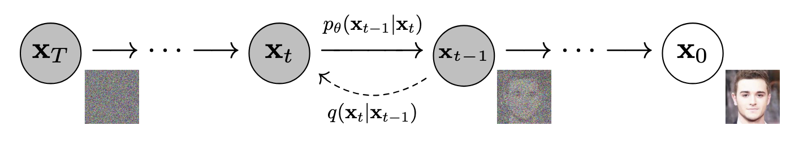
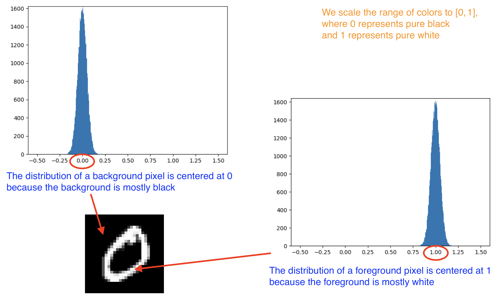
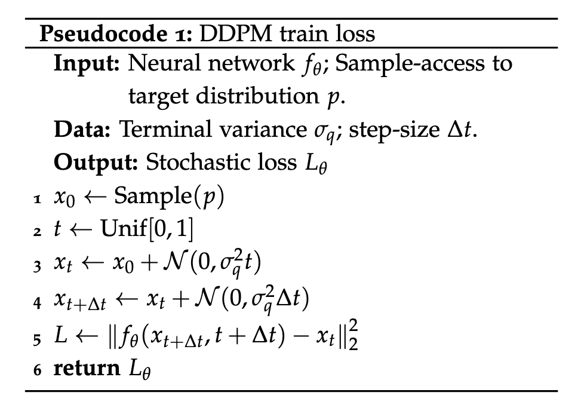
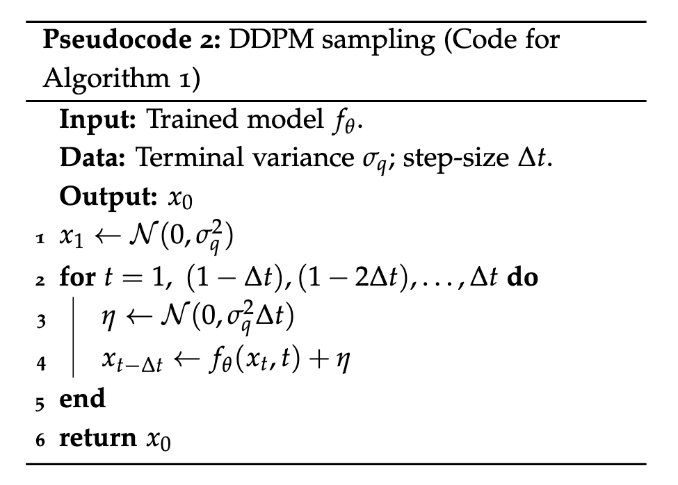
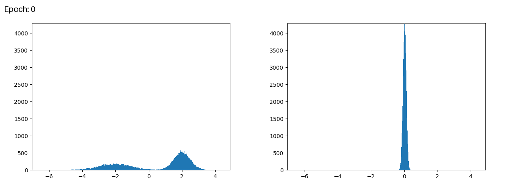
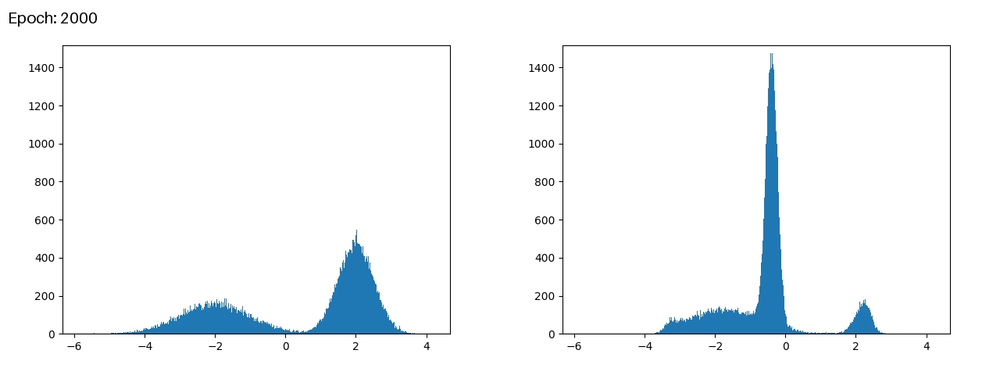
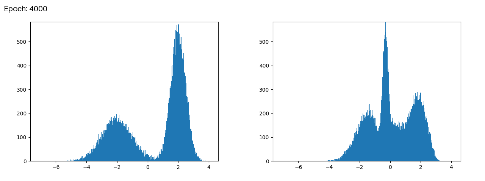
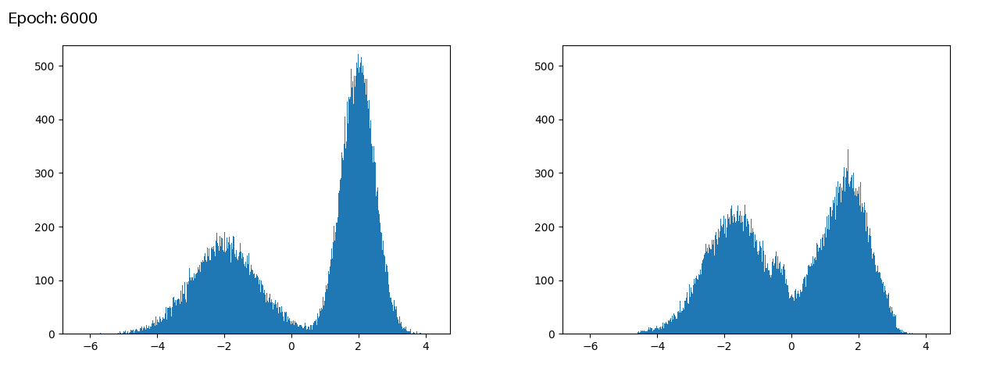
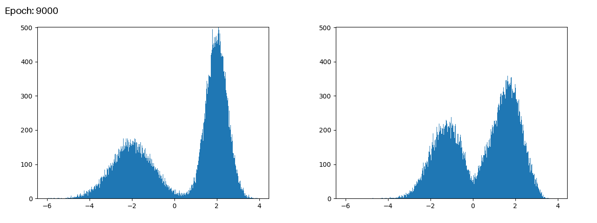

# Denoising Diffusion Probabilistic Models (DDPM)
## 1. Introduction
Diffusion is one of the hottest machine learning techniques as of 2025 (you have to admit: Transformers are boring and definitely not all we need). But have you ever wanted to learn more about diffusion - even starting from the most basic methods - only to spend days searching for tutorials online, and end up giving up again and again? Do you ever feel that, no matter how hard you try, there always seems to be too much math required to catch up with diffusion (compared to Transformers, which, as I said, are boring)?

I share the same feeling - and that's actually a good thing. Diffusion is hard, and that's exactly what makes it so interesting and worth learning about.

In this article, I want to share my experience developing the most minimal DDPM (Denoising Diffusion Probabilistic Models) ever: written in pure PyTorch, requiring no GPU to train, and containing as little code as possible. My purpose is simple: I just want to share what I've learned so far, to thank the people who also share their knowledge with the world. You can find more details in [the resources](#5-references) I used when writing this article, but I promise to keep the content as easy to understand as possible.

Still not feeling motivated? Here's your kick: diffusion is not just a single technique but a whole class of related methods. One of these methods leverages SDE (Stochastic Differential Equations), which are key to many applications in physics, engineering, and even finance. Have you ever heard of [Black-Scholes model](https://en.wikipedia.org/wiki/Black%E2%80%93Scholes_model), which helped its authors win the Nobel Prize? Yes, the core of that model is an SDE, as you might have guessed.

This article covers DDPM in a very basic and straightforward, without being too technical. Learning about DDPM is the first step toward understanding diffusion, and once you become more familiar with it, you'll have a powerful tool in hand to explore many real-world applications across various domains.

So, what are you waiting for? Let's go!

<details><summary>Note: Before we get started, let's agree on something (click to expand)</summary>

- I'll try my best, but I'm not an machine learning expert, so I may be wrong about some things. Feel free to contact me to discuss anything you're concerned about.
- The source code is hosted in [`./minimal_ddpm/`](./minimal_ddpm/). Results are saved to `../storage/minimal_ddpm/`. I've also uploaded my results to [`./assets/result/`](./assets/result/) for anyone who just wants to check quickly and is too lazy to run it themselves.
</details>

## 2. Review of DDPM
This section is mostly based on [Nakkiran et al. (2024), "Section 2. Stochastic Sampling: DDPM"](#5-1-step-by-step-diffusion-an-elementary-tutorial), which differs slightly in technical details from [Ho et al. (2020)](#5-3-denoising-diffusion-probabilistic-models) - the original DDPM paper. While readers are encouraged to explore these papers themselves, this section is written in a beginner-friendly style so that anyone can understand it:
- We do not cover the mathematics in full detail, but instead start from the overall picture and gradually clarify only the most important parts in simple language.
- Some lemmas will be presented and treated as given facts, allowing us to use them without delving into detailed proofs.

### 2-1. DDPM in a Nutshell

[Ho et al. (2020), Figure 2](#5-3-denoising-diffusion-probabilistic-models)

You may have heard about DDPM somewhere. Its algorithm sounds pretty simple: it consists of two processes. The *forward process* adds Gaussian noise to the real data, turning it into purely noisy data. The *reverse process* does the opposite by learning to remove this noise to recover the real data from the noisy data.

In order to help you understand DDPM, the rest of this section is divided into two parts:
- [Section 2-2. Basic knowledge](#2-2-basic-knowledge): Presents an overview of some technical terms that form the foundational knowledge for working with data in machine learning.
- [Section 2-3. DDPM Algorithm](#2-3-ddpm-algorithm): Explains the training and inference procedures described in [Nakkiran et al. (2024)](#5-1-step-by-step-diffusion-an-elementary-tutorial), focusing on the feasibility of learning a model of the *reverse process*.

### 2-2. Basic Knowledge
#### 2-2-1. Distribution
Working with data in machine learning means working with distributions, and this is one of the most fundamental terms that anyone needs to grasp before going any further.

So, what is a "distribution" of data? Everything in this universe obeys the rules of probability and statistics: we are all described by variables drawn from certain probability functions. For example: the heights of students in the same class, the daily amount of sunshine in a city, or the outcomes of dice rolls. "Events" within the same "observation" are instances that share the same distribution, each one has its own probability - the chance that it can occur - described by that distribution.


Let's take an image from [MNIST dataset](https://en.wikipedia.org/wiki/MNIST_database) as an example. Each pixel in the image has its own distribution that depends on its position, and all the pixels at the same position across different images share this distribution. Some positions may be mostly black, some mostly white, and some may vary between black and white. In the real world, each data point can follow a particular distribution that may differ significantly from others: different means, different variances, or even multiple "peaks".

Disclaimer: This is just an illustration. I haven't investigated the actual distribution of all MNIST images, so this might not be entirely accurate, but I believe it's roughly correct.

#### 2-2-2. Generative Models
You often hear about "generative AI" nowadays, but what is your impression? "Generative AI" sounds like AI that can "generate things", doesn't it?

No, unfortunately, this isn't a sufficient definition. Theoretically, you could create a non-generative AI model that "naively" produces data, but its output might not be "beautiful" or might not follow the "rules" of the data. For example, imagine you build a dummy text generation model that always outputs "I am Groot". Is this model able to "generate" text? Technically, yes! But is it truly generative? Not so sure.

"Generative" isn't about the type of model or its architecture, but rather about "something" that the model has learned. Even SOTA generative models like [DeepSeek R1](https://github.com/deepseek-ai/DeepSeek-R1) aren't generative at the moment before training.

So, what is that "something" that a model must learn to become "generative"? The answer is: the "distribution"! Yes, the distribution of the data we mentioned earlier!

Here is our official definition of a generative model on [Wikipedia](https://en.wikipedia.org/wiki/Generative_model):
> A generative model is a statistical model of the joint probability distribution $P(X,Y)$ on a given observable variable $X$ and target variable $Y$.

Remember, this statement is correct in the context of supervised learning, where you have both observable data $X$ and target labels $Y$. In diffusion models, however, there is no $Y$, we only have $X$ - the data we want to generate. So it's okay to understand that:
> [!NOTE]
> A model trained with DDPM is generative and learns to approximate the data distribution $P(X)$.

That means a model trained with DDPM has "knowledge" of the data distribution we feed into it. The question is: how is this possible? Let's reveal its secret by looking at the core of the DDPM algorithm.

### 2-3. DDPM Algorithm
Now it's time to look at the most important part of this section: the DDPM algorithm. As mentioned earlier, we won't go too deep into the math, instead, we'll go through the algorithm line by line and focus on the steps that aren't immediately obvious during training and inference.

#### 2-3-1. Training Procedure


[Nakkiran et al. (2024), "Pseudocode 1"](#5-1-step-by-step-diffusion-an-elementary-tutorial)

**Overview**
> **Input**: Neural network $f_\theta$; Sample-access to target distribution $p$.\
> **Data**: Terminal variance $\sigma_q^2$; step size $\Delta t$.\
> **Output**: Stochastic loss $L_\theta$.
- We have two distributions:
  - *Target distribution* $p$: the distribution we don't know but want to learn.
  - Fully noised *terminal distribution* (chosen to be a normal distribution $\mathcal{N}$ with mean $0$ and variance $\sigma_q^2$): used as a "latent" distribution from which we can transform back into the *target distribution*.
- The transformation between the *target distribution* and the *terminal distribution* is performed through a sequence of time steps, each with a step size $\Delta t$, and consists of two opposite processes:
  - *Forward process*: a [Markov chain](https://en.wikipedia.org/wiki/Markov_chain) that gradually applies the *forward transition* $p(x_{t+\Delta t}\mid x_t)$ at each time step to transform the *target distribution* into the *terminal distribution*.
  - *Reverse process*: also a Markov chain that gradually applies the *reverse transition* $p(x_t\mid x_{t+\Delta t})$ to transform the *terminal distribution* back into the *target distribution*.
- Our task is to train a neural network $f_\theta$ by optimizing the loss $L_\theta$ so that it can perform the *reverse process*. Details about this network and the loss will be shown later.

**Step 1 → 4**
> 1. $x_0\leftarrow Sample(p)$
> 2. $t\leftarrow Unif[0,1]$
> 3. $x_t\leftarrow x_0+\mathcal{N}\left(0,\sigma_q^2t\right)$
> 4. $x_{t+\Delta t}\leftarrow x_t+\mathcal{N}\left(0,\sigma_q^2\Delta t\right)$
- We simultaneously draw many samples $x_0$ from the *target distribution*, "move" them to arbitrary time steps $t$ by adding noise drawn from $\mathcal{N}\left(0,\sigma_q^2t\right)$.
- We then "move" $x_t$ to the next time step $x_{t+\Delta t}$ by adding another small amount of noise drawn from $\mathcal{N}\left(0,\sigma_q^2\Delta t\right)$. Remember that, this is the *forward transition* $p\left(x_{t+\Delta t}\mid x_t\right)$, which can be shown to be a normal distribution.
- So far, this is the *forward process*, and we are just preparing the data for $x_t$ and $x_{t+\Delta t}$. But the interesting part is how we choose the variance $\sigma_q^2\Delta t$ for our noise. You can read more about it in [Nakkiran et al. (2024), "Section 1.3: Discretization"](#5-1-step-by-step-diffusion-an-elementary-tutorial). I won't go into detail about the reasons here, but this choice has a strong connection to Brownian motion and stochastic calculus. I recommend reading [Brownian Motion Calculus](https://www.wiley.com/en-us/Brownian+Motion+Calculus-p-9780470021705) for more on this topic.
> [!IMPORTANT]
> **Lemma 1**: We need to choose the variance of each increment $\sigma^2=\sigma_q^2\Delta t$ to ensure that the terminal variance is always $\sigma_q^2$ regardless of the number of time steps.

**Step 5**
> 5. $`L\leftarrow\|f_\theta\left(x_{t+\Delta t},t+\Delta t\right)-x_t\|_2^2`$
- Here is **the most critical part of the DDPM algorithm**: we train our network to learn $p\left(x_t\mid x_{t+\Delta t}\right)$ by using mean squared error (MSE) as the loss function. In other words, we train our network to take data at time step $t+\Delta t$ as input and produce the corresponding data at time step $t$ as output.
- But is this sufficient? Recall that MSE only helps us learn the [conditional mean](https://en.wikipedia.org/wiki/Conditional_expectation) $\mathbb{E}\left[x_t\mid x_{t+\Delta t}\right]$, not the full distribution $p\left(x_t\mid x_{t+\Delta t}\right)$. Fortunately, this turns out to be totally fine, because we already have enough information about the *reverse transition* $p\left(x_t\mid x_{t+\Delta t}\right)$, the only unknown is its mean $\mathbb{E}\left[x_t\mid x_{t+\Delta t}\right]$, which we train our network to estimate.\
  You can read more about this in [Nakkiran et al. (2024), "Fact 1"](#5-1-step-by-step-diffusion-an-elementary-tutorial)
> [!IMPORTANT]
> **Lemma 2**: The *reverse transition* $p\left(x_t\mid x_{t+\Delta t}\right)$ has a form similar to the *forward transition* $p\left(x_{t+\Delta t}\mid x_t\right)$: it is approximately Gaussian (normal distribution), with the same variance $\sigma_q^2\Delta t$ and some unknown mean $\mu$, provided that the step size $\Delta t$ is sufficiently small.
>
> That means, to fully learn $p\left(x_t\mid x_{t+\Delta t}\right)$, it is enough for our network to learn only the mean $\mathbb{E}\left[x_t\mid x_{t+\Delta t}\right]$.

#### 2-3-2. Inference Procedure


[Nakkiran et al. (2024), "Pseudocode 2"](#5-1-step-by-step-diffusion-an-elementary-tutorial)

**Step 1**
> 1. $x_1\leftarrow \mathcal{N}\left(0,\sigma_q^2\right)$
- We start by taking a sample from the *terminal distribution*, which is a normal distribution with mean $0$ and variance $\sigma_q^2$.

**Step 2 → 4**
> 2. for $t=1,\left(1-\Delta t\right),\left(1-2\Delta t\right),...,\Delta t$ do
> 3. &nbsp;&nbsp;&nbsp; $\eta\leftarrow\mathcal{N}\left(0,\sigma_q^2\Delta t\right)$
> 4. &nbsp;&nbsp;&nbsp; $x_{t-\Delta t}\leftarrow f_\theta\left(x_t,t\right)+\eta$
- We reverse $x_t$ to $x_{t-\Delta t}$ by applying the *reverse transition* $p\left(x_{t-\Delta t}\mid x_t\right)=f_\theta\left(x_t,t\right)+\eta$, which is a Gaussian with mean $\mu=f_\theta\left(x_t,t\right)$ (the network's output predicting the data at time step $t-\Delta t$ based on the input data at time step $t$, as described in the training procedure) and variance $\sigma_q^2\Delta t$.
- By doing this, we reverse $x_1$ to $x_0$ through many intermediate steps, gradually transforming the *terminal distribution* back into the *target distribution*. Since we can obtain the *target distribution* via this *reverse process*, our network trained with DDPM is indeed a generative model, as we claimed above.

## 3. Experiment
Ok, enough with the theory. Let's get our hands dirty by performing a real experiment together to fulfill our main purpose: developing a minimal DDPM.

You can always experiment with bigger models, but starting from a smaller one is much easier and more cost-efficient. Once you grasp the main idea of DDPM, scaling it up to real-world generative models should (hopefully) not be a problem. You may have heard about many of them popping up recently and attracting a lot of attention: [Stable Diffusion](https://stability.ai/stable-image), [Gemini Diffusion](https://deepmind.google/models/gemini-diffusion/), and so on. Our goal is not to defeat them, instead, it's to train as minimal a DDPM as possible.

### 3-1. Goal
Keep in mind that DDPM is not the only way to train a diffusion model - you can choose other methods and combine them with other techniques as well (such as the boring Transformers). But whatever you eventually want to achieve, it's still meaningless if you don't have a sense of how diffusion works under the hood, no matter how complicated your models are.

Then, what is the most minimal DDPM training possible? You can check the source code at [`./minimal_ddpm/`](./minimal_ddpm/), but here are our main steps described in simple words:
1. Generate an arbitrary univariate distribution (for example, **a bimodal distribution of a single variable** with two peaks) as the *target distribution*.
2. Define a deep neural network that takes **a single scalar as input** and produces **a single scalar as output** (I omit the batch size dimension for simplicity).
3. Follow the training procedure described in [Section 2-3. DDPM Algorithm](#2-3-ddpm-algorithm) to train the network.
4. Confirm that after training, when our network takes sufficiently large inputs drawn from a normal distribution, **its outputs form a *learned distribution* with a similar "shape" to the *target distribution***.

<details><summary>Deployment Instructions (click to expand)</summary>

Change to [`../deployment-local/`](../deployment-local/) directory:
```console
host$ cd ../deployment-local/
```

Start and get inside the container:
```console
host$ docker compose up --build --remove-orphans -d
host$ docker compose exec minimal_ddpm bash
```

Run the program:
```console
minimal_ddpm# uv sync
minimal_ddpm# uv run python main.py
```
</details>

### 3-2. Results
At each epoch, we plot the histograms of the two distributions and save them as image files (which you can quickly view in [`./assets/result/`](./assets/result/)). The left side shows the *target distribution*, and the right side shows the *learned distribution*.

At epoch 0, since our network hasn't learned anything yet, its outputs form a thin, stick-like distribution centered around $0$. I suppose this is because our network simply produces nearly all zeros regardless of the input.


As we proceed to later epochs, our network gradually learns to "mimic" the *target distribution*, and the *learned distribution* it produces becomes increasingly similar in shape to its target: the thin "stick" at zero keeps shrinking, while the two peaks of the bimodal distribution continue to grow.

Note: You may notice that the *target distribution* on the left side appears to be "growing" as epoch increases, but this isn't really true. Its shape remains unchanged - you can confirm this by looking at the scale of the vertical axis.




And eventually, our network's proud *learned distribution* looks very much like the target. Time to congratulate ourselves!


### 3-3. My Insights
So far so good, right? We've developed the most minimal DDPM ever - and the good news is: it works! But there are still some things that concern me, and I definitely want to investigate them further when I have time.
- The two peaks that our network learned have some properties that differ from the target: the left peak has its mean around $-1$ instead of $-2$, and the right peak isn't high enough. No matter how long I train the network, these two peaks never move as far apart as in the *target distribution*.
- Loss values decrease really quickly (you can check them in [`./assets/result/log.csv`](./assets/result/log.csv)). It reaches $0.01$ by epoch 2000 and barely improves even when training continues up to epoch 9000, so I'm not sure how to judge whether the training has actually converged.\
  Interestingly, the value where the loss plateaus (in this case, $0.01$) is the same as the step size `dt` I chose as a hyperparameter (see [`./minimal_ddpm/model.py`](./minimal_ddpm/model.py)). If I change this step size, the minimum loss value also changes to match that new step size. Perhaps there's some mathematical relationship here that I don't yet understand.

## 4. Conclusion
Nothing is perfect, and our little network isn't either. There may also be some bugs in my code, or perhaps my understanding of DDPM has flaws. Who knows? The point is: just like our little network, we might not fully reach our target - but we never give up on learning.

Diffusion models, like many other techniques in machine learning, draw huge inspiration from physics and often serve as a bridge between theoretical research and empirical engineering. Fully understanding them may take a very long time, since it requires many mathematical skills - not only in probability, calculus, and linear algebra, but also in stochastic process (such as Markov chains and SDEs).

It's challenging, but by taking small steps one by one, I believe that each of us can someday reach our own *target distribution*, just like our little network. And by sharing what we've learned with each other like this, we can spread knowledge throughout the world - like a diffusion process itself.

## 5. References
Huge kudos to these awesome people and their papers. I appreciate them so much.

#### 5-1. Step-by-Step Diffusion: An Elementary Tutorial
[Nakkiran et al. (2024)](https://arxiv.org/abs/2406.08929): The base paper on which this article is built.

#### 5-2. Tutorial on Diffusion Models for Imaging and Vision
[Chan et al. (2024)](https://arxiv.org/abs/2403.18103): Similar, but with more technical details.

#### 5-3. Denoising Diffusion Probabilistic Models
[Ho et al. (2020)](https://arxiv.org/abs/2006.11239): The original DDPM paper.

#### 5-4. Deep Unsupervised Learning using Nonequilibrium Thermodynamics
[Sohl-Dickstein et al. (2015)](https://arxiv.org/abs/1503.03585): Provides a general discussion of the diffusion process in connection with statistical physics.

... and so on
